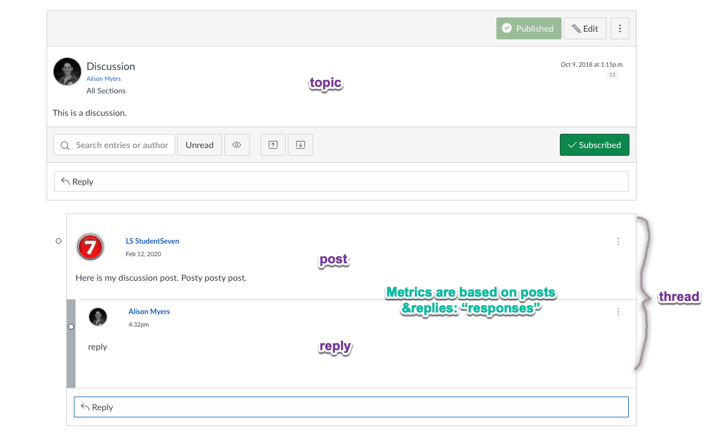

[](https://standardjs.com)

> 💡 If you are teaching at the University of British Columbia, you may also be interested in the tool `Threadz` which provides visualizations and data from your Canvas discussion forums through a user interface in Canvas. You can learn more about the tool and how to request access in your course from the [LTHub Instructor Guide](https://lthub.ubc.ca/guides/threadz-instructor-guide/). `Threadz` was developed by Eastern Washington University.

# Canvas Discussion

### Data
> `{course_id}-discussion.csv`  

This project pulls discussion data via the Canvas API for the specified Canvas course(s) and exports the results as CSV. The columns exported are:
* 'topic_id',
* 'topic_title',
* 'topic_message',
* 'topic_author_id',
* 'topic_author_name',
* 'topic_created_at',
* 'topic_posted_at',
* 'response_author_id',
* 'response_author_name',
* 'response_id',
* 'response_parent_id',
* 'response_message',
* 'response_likes',
* 'response_timestamp'

Where a `topic` corresponds to a `discussion_topic` and `response` refers to all posts and replies to the `discussion_topic`. If a `discussion_topic` has no posts or replies then you will see the `topic_` columns filled with no corresponding `response_` data. A `response` may have a `response_parent_id` if it is part of a threaded response (i.e is a `reply`).

### Summary Data
> `{course_id}-discussion-summary.csv`

We have calculated summary metrics for each topic. The csv with the summary information includes the following columns:

* 'topic_id',
* 'topic_title',
* 'topic_author_id',
* 'topic_author_name',
* 'topic_posted_at',
* 'number_of_responses': the total number of posts and replies in the topic
* 'average_responses_per_author': the average posts per author (does not include enrollments with no posts)
* 'median_responses_word_count': the median word count for all posts and replies to the topic
* 'average_days_to_respond_from_posted_at': the average number of days to post from the topic posted_at date. A 'day' is calculated by date, not hours
* 'first_response_timestamp': the timestamp of the first post
* 'average_days_to_respond_from_first_response': the average number of days to post from first topic response. A 'day' is calculated by date, not hours


Where a `post` is a direct response to a topic, and a `reply` is a reply to the post. Together the `posts` and `replies` are `responses`. 



### Additional Explanations
- `A 'day' is calculated by date, not hours`
> For instance, for the topic discussion summary, if the topic was posted_at '2024-01-02 12pm' and there was 1 response at '2024-01-03 4pm', then the average_days_to_post would be 1. If the topic as was posted_at '2024-01-01' and all replies were the same day ('2024-01-01') then the average_days_to_post would be 0. 

- `does not include enrollments with no posts`
> The calculations are only based on posts or authors who contribute, not expected posts or number of authors; for instance, in a class of 10 students, if 5 students made 1 post each and 5 students made 0 posts the `average_responses_per_author` is 1 (mean: 1,1,1,1,1), **not** 0.5 (mean: 1,1,1,1,1,0,0,0,0,0). 

## Getting Started
These instructions will get you a copy of the project up and running on your local machine for use with your own API tokens and Canvas domains.

### Prerequisites

1. **Install [Node 10 or greater](https://nodejs.org)**.
1. **Install [Git](https://git-scm.com/downloads)**.

### Installation and execution of script

1. Clone this repo. `git clone https://github.com/ubccapico/canvas-discussion.git`
1. Then cd into the repo. `cd canvas-discussion`
1. Run the installation script. `npm install` (If you see `babel-node: command not found`, you've missed this step.)
1. Generate Canvas API token and copy it to clipboard
    > - See [Get Started with the Canvas API](https://learninganalytics.ubc.ca/guides/get-started-with-the-canvas-api/) for more information.
    > - ⚠️ Your Canvas API token is the equivalent to your username and password and must be treated as such (following any security guidelines of your home institution).
1. Create a `.env` file.
1. Add the following: `CANVAS_API_TOKEN={YOUR API TOKEN}`, `CANVAS_API_DOMAIN={YOUR API DOMAIN}`, `COURSE_IDS={YOUR COURSE ID(s)}`. 
     - At UBC the `CANVAS_API_DOMAIN` is `https://ubc.instructure.com/api/v1`
     - At another institution it might be something like `https://{school}.instructure.com/api/v1`
    Your .env file should look like
    ```
    CANVAS_API_TOKEN=22322...
    CANVAS_API_DOMAIN=https://ubc.instructure.com/api/v1
    COURSE_IDS=1111,1112
    ```
2. Run the script. `npm start`.
3. A `{course_id}-discussion.csv` and a ` {course_id}-discussion-summary.csv` file should be generated with discussion data in the output folder for each provided course_id.

## Authors

* [justin0022](https://github.com/justin0022) - **Justin Lee** &lt;justin.lee@ubc.ca&gt;

## License

This project is licensed under the GNU General Public License v3.0.
